# Reload application solution — overview

See [`00-topology.md`](00-topology.md) first — it corrects several assumptions about
where things live and which folders are real repos. This doc summarizes what the system
does and how the pieces fit together, based only on what was verified there.

## What this is

Fiuu's "reload" system is a prepaid top-up / retail payment platform: physical and
software point-of-sale terminals at dealers/stores submit transactions (telco airtime
reload, e-wallet reload, gift cards, bill payment, etc.) which get validated, priced
(commission/margin calculation), persisted, and routed out to the relevant external
partner network, with a back-office web portal for merchant/dealer/product/commission
administration and a family of scheduled jobs for reporting, reconciliation, and
settlement.

Confirmed partner integrations (from actual code, not marketing material):
**TNG** (Touch 'n Go e-wallet reload), **INCOMM** (gift cards), plus a large partner
roster referenced only via AWS Secrets Manager label names (see
[`00-topology.md`](00-topology.md) §7) that wasn't traced end-to-end: Astro, Celcom,
Digi, DTOne, JomPay, ATX, AnyPay, IIMMPACT, IWK, Telekom, and others. EInvoice
(Malaysia e-invoicing) and "Restorify" (carbon-offset subscription billing, despite the
name — see [`class-library/reloads-restorify.md`](class-library/reloads-restorify.md))
are separate business lines living in the same monorepo.

## Components (all live inside the single `reload` repo)

| Doc | What it covers |
|---|---|
| [`web-api.md`](web-api.md) | `Reloads/Terminal/Api` — the terminal-facing REST API (and `BackOffice/Api`) |
| [`web-app.md`](web-app.md) | `BackOffice/Web` — the merchant/dealer back-office WebForms portal |
| [`reload-portal.md`](reload-portal.md) | Open question: no separate "portal" codebase found — see that doc |
| [`terminal-application.md`](terminal-application.md) | `Reloads/TerminalServer/Console` — the legacy TCP socket server for POS hardware, plus its `ControlPanel` monitor |
| [`console-app.md`](console-app.md) | The family of per-module `Scheduler`/background-job console apps |
| [`class-library/`](class-library/) | The shared submodule + `Components/*` source libraries — one doc per module (`cepp`, `einvoice`, `logging`, `lookup`, `masterframework`, `provider`, `reloads-pin`, `reloads-restorify`, `awscore`, `database`, `secure`, plus bonus docs `notification` and `reloads-tng-game` for two more real modules found along the way) |

## Component / dependency diagram

This reflects **actually-observed** `ProjectReference`/`Reference`+`HintPath` entries in
`.csproj`/`.vbproj` files (see each component doc for the specific file citations), not
an idealized layering. Dotted edges mark the legacy `web/Libraries/NET` vendored-DLL
path (older, parallel to the `class-library` route for the same module names).

```mermaid
flowchart TB
    subgraph Apps["Applications (reload/web/DEV/NET/Applications)"]
        WebApi["Reloads/Terminal/Api<br/>(Fiuu.App.Reloads.Terminal.Api)"]
        BOApi["BackOffice/Api"]
        BOWeb["BackOffice/Web<br/>(WebForms portal)"]
        TermSrv["Reloads/TerminalServer/Console<br/>(TCP socket server)"]
        MOLCore["MOLReloads/Core<br/>(Fiuu.Reloads — TNGService, GiftCardService)"]
        Schedulers["Per-module Scheduler console apps<br/>(BackOffice/EInvoice/EPay/Game/OnlineTopUp/<br/>Pinless/Reloads/Reports/Restorify/Ticket)"]
        PinCore["Pin/Core, Pinless/Core"]
        RestorifyCore["Restorify/Core + Api"]
        EInvoiceCore["EInvoice/Core"]
        NotificationApp["Notification/Api + Client"]
    end

    subgraph Components["Components (reload/web/DEV/NET/Components) — source, ProjectReference"]
        CEPP["CEPP<br/>(Fiuu.CEPP + Payment/{TNG*,INCOMM,MOLPay,Ticket,OfflinePayment})"]
        Logging["Logging (Fiuu.Logging)"]
        Lookup["Lookup (Fiuu.Lookup)"]
        MasterFramework["MasterFramework<br/>(DI/Autofac, Caching, Crypto, Utilities)"]
        Provider["Provider (Fiuu.Provider)"]
        ReloadsPatching["ReloadsPatching"]
        UMobileComp["UMobile"]
    end

    subgraph ClassLib["class-library submodule"]
        AWSCore["AWSCore<br/>(Secrets Manager)"]
        Database["Database (Fiuu.Database)<br/>Dapper + RMS_OFFLINE providers"]
        TNGSrc["Reloads/TNG (source)"]
        GameSrc["Reloads/Game (source)"]
        SecureAstro["Secure/Astro"]
        SecureIncomm["Secure/Incomm (ISO8583)"]
        SecureTelekom["Secure/Telekom (SOAP)"]
        PrebuiltDlls["Prebuilt DLLs at repo root:<br/>Fiuu.CEPP / EInvoice / Logging / Lookup /<br/>MasterFramework / Provider / Reloads.Pin /<br/>Reloads.Restorify / MOL.Notification.Client"]
    end

    subgraph LegacyLibs["reload/web/Libraries/NET (legacy vendored DLL drop)"]
        LegacyLogging["Fiuu.Logging.1.1.0"]
        LegacyMF["Fiuu.MasterFramework.1.1.0"]
        LegacyLookup["Fiuu.Lookup"]
        LegacyNotif["MOL.Notification.Client.1.0.0"]
    end

    WebApi --> MOLCore
    WebApi --> CEPP
    WebApi -.-> LegacyLogging
    WebApi -.-> LegacyMF
    MOLCore --> CEPP
    MOLCore --> TNGSrc
    MOLCore --> GameSrc
    MOLCore --> RestorifyCore
    BOWeb --> CEPP
    BOWeb --> Lookup
    BOWeb --> ReloadsPatching
    BOWeb -.-> LegacyLogging
    BOWeb -.-> LegacyLookup
    BOWeb -.-> LegacyMF
    BOApi --> Database
    NotificationApp -.-> LegacyNotif
    CEPP --> Lookup
    CEPP --> Logging
    CEPP --> MasterFramework
    CEPP --> PrebuiltDlls
    CEPP --> SecureIncomm
    Schedulers --> Database
    Schedulers --> TNGSrc
    Schedulers --> GameSrc
    TNGSrc --> AWSCore
    SecureAstro --> AWSCore
    SecureIncomm --> AWSCore
    SecureTelekom --> AWSCore
    PinCore --> PrebuiltDlls
    TermSrv --> CEPP

    Logging --> PrebuiltDlls
    Lookup --> PrebuiltDlls
```

**Reading this diagram:** solid arrows are confirmed `ProjectReference`/direct source
dependencies; dotted arrows are confirmed `HintPath` references to the legacy
`Libraries/NET` vendored copies that coexist alongside (and are not fully replaced by)
`class-library`. `PrebuiltDlls` is drawn as one node because multiple modules reference
individual DLLs from that same `class-library` root directory (e.g. `Fiuu.CEPP.csproj`
references `class-library\Fiuu.Lookup.dll` directly, on top of also depending on the
`Lookup` component's source elsewhere) — see per-module docs for exactly which DLL each
consumer references. `TermSrv --> CEPP` is a lower-confidence edge — the terminal
socket server's dozens of VB `MessageHandlers` were not individually traced to confirm
each one calls into the same `CEPP`/`MOLReloads.Core` services the REST API uses (see
[`terminal-application.md`](terminal-application.md) for the caveat). Note that
`AWSCore` is reached **only** through `Reloads/TNG` and the three `Secure/*` modules
at the `.csproj` level — no application project (`Restorify/Core`, `EInvoice/Core`,
etc.) references it directly, even though `AWSCore/Enums/SecretsLabels.cs` defines
label groups for partners (EInvoice, EPay, and many more) with no confirmed
`ProjectReference` path to them. See [`class-library/awscore.md`](class-library/awscore.md)
for that open question.

## Sequence diagrams

Traced end-to-end from real controller/service code (see each file for exact source
citations):

- [`diagrams/tng-reload-flow.md`](diagrams/tng-reload-flow.md) — TNG e-wallet card
  transaction via the Terminal API.
- [`diagrams/giftcard-incomm-flow.md`](diagrams/giftcard-incomm-flow.md) — INCOMM gift
  card initiate + confirm via the Terminal API.
- [`diagrams/einvoice-submission-flow.md`](diagrams/einvoice-submission-flow.md) —
  EInvoice end-customer submission — a scheduled batch job, not a live-transaction
  trigger (a correction to the natural assumption); fully traced except for the
  identity of the external gateway it calls, which isn't named anywhere in code.

## What wasn't traced in this pass

- `reload_db` itself (schema, stored procedures) — out of scope; see the
  `reload-db-schema` skill for that.
- Every one of the ~60 `MessageHandlers` in the terminal socket server.
- The exact build/publish mechanism that turns `Components/*` and `Applications/*/Core`
  source into the prebuilt DLLs committed at `class-library`'s repo root (see
  [`00-topology.md`](00-topology.md) §4).
- `power_bi/` and `powershell/` — confirmed empty, nothing to trace.
- Any second "reload_portal" codebase — see [`reload-portal.md`](reload-portal.md).

## Related

- [[architecture/reload/00-topology]] — the verification pass this overview is built on
- [[architecture/reload/class-library/reloads-restorify]] — the carbon-offset product line mentioned above (naming correction)
- [[architecture/reload/class-library/awscore]] — the partner-secrets mechanism behind the roster listed above
- [[architecture/reload_db/00-overview]] — the database estate this application talks to
- [[gitlab-analysis/reload-tribal-knowledge]] — recurring bug classes across the components diagrammed here
