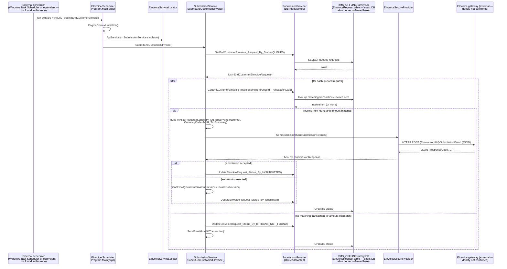

# Sequence: EInvoice end-customer submission (scheduled batch job)

Unlike the other two diagrams, this flow is **not** triggered by a live terminal
request — it's a scheduled/batch job. This corrects an initial assumption that
EInvoice submission would be triggered synchronously from a transaction. Sources, all
read directly:
- `reload/web/DEV/NET/Applications/EInvoice/Scheduler/Program.cs` (read in full)
- `reload/web/DEV/NET/Applications/EInvoice/Core/Services/ServiceLocator.cs` (read in
  full)
- `reload/web/DEV/NET/Applications/EInvoice/Core/Services/SubmissionService.cs`
  (`SubmitEndCustomerEInvoice()` read in full)
- `reload/web/DEV/NET/Applications/EInvoice/Core/Providers/SecureApi/EInvoiceSecureProvider.cs`
  (read in full)

## What's confirmed vs. inferred/unknown

- **Confirmed:** the console app is invoked with a numeric `ScheduleType` argument
  (something external — Windows Task Scheduler or equivalent — must supply this; the
  scheduler mechanism itself is outside this repo and wasn't found); it initializes
  the DI container (`EngineContext.Initialize()`), then dispatches to one of several
  `EInvoiceServiceLocator.ApiService`/`ReportService` methods based on that argument.
  `SubmitEndCustomerEInvoice()`'s full body was read: it pulls `QUEUED` requests from
  the database, validates each against a matching transaction/invoice item, builds an
  `InvoiceRequest` (with `CurrencyCode.MalaysiaRinggit` hardcoded — a strong signal
  this is a Malaysia-specific compliance flow), and posts it via
  `EInvoiceSecureProvider.SendSubmision(...)`, updating the request's status in the
  database based on the result (and sending an alert email on failure).
- **Unknown / not confirmed anywhere in code:** the identity of the external gateway
  at `AppSettings["EInvoiceApiUrl"]`. No literal "LHDN"/"MyInvois"/"IRBM" string was
  found anywhere under `Applications/EInvoice/` — see
  [`../class-library/einvoice.md`](../class-library/einvoice.md) for that caveat. This
  diagram labels it generically as "EInvoice gateway (external)" rather than naming a
  specific national authority.
- **Not traced:** what actually enqueues a row with status `QUEUED` in the first
  place (i.e. which part of the system decides an end-customer invoice needs
  generating) — that producer side of the queue wasn't found in this pass.

A separate scheduled operation, `Hourly_EInvoiceRetry`
(`EInvoiceServiceLocator.ApiService.Retry()`), exists alongside this for retrying
failed submissions — its body was not read in this pass, but its existence confirms
there's a retry mechanism distinct from the initial submission path shown above.

## Related

- [[architecture/reload/class-library/einvoice]] — the `EInvoice/Core` component this flow is built from
- [[architecture/reload_db/einvoice]] — the `EINVOICE` database whose `TRANS.Submissions`/`Invoices` this flow writes to
- [[gitlab-analysis/reload-tribal-knowledge]] — the ongoing monthly resubmission-patch pattern (§5) for this same integration
