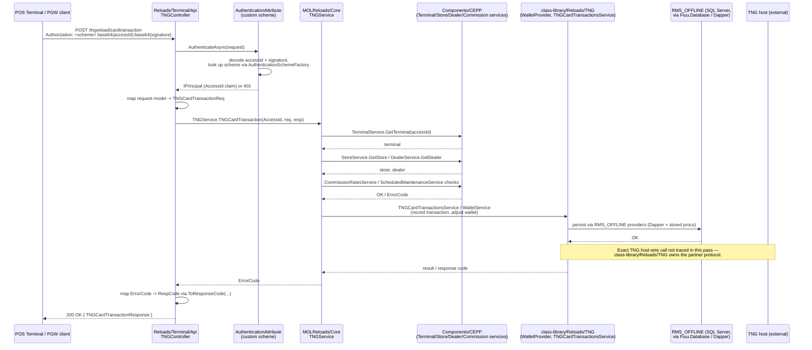

# Sequence: TNG e-wallet card transaction (via Terminal API)

Traced from real code, not assumed. Primary sources:
- `reload/web/DEV/NET/Applications/Reloads/Terminal/Api/Controllers/TNGController.cs`
- `reload/web/DEV/NET/Applications/Reloads/Terminal/Api/Controllers/RMSAuthController.cs`
- `reload/web/DEV/NET/Applications/Reloads/Terminal/Api/Infrastructure/Security/AuthenticationAttribute.cs`
- `reload/web/DEV/NET/Applications/MOLReloads/Core/Services/TNGService.cs`
- `reload/class-library/Reloads/TNG/*` (referenced, not individually read beyond
  confirming its existence and structure — see
  [`../class-library/reloads-tng-game.md`](../class-library/reloads-tng-game.md))

Chosen because `TNGController.TNGCardTransaction` is a fully-readable, representative
example of the controller → service pattern used by every TNG endpoint
(`TNGProfile`, `TNGHostAuthentication`, `TNGOnlineCardValidation`,
`TNGBlacklistedCard`, `TNGFundRequest` all follow the identical shape).

## What's confirmed vs. inferred

- **Confirmed:** the HTTP entry point, the custom auth scheme shape, the controller
  → `TNGService` call, the `ErrorCode` → HTTP response mapping, and that
  `TNGService` resolves its dependencies (`ITerminalService`, `ITNGTerminalService`,
  etc.) through the Autofac-based `EngineContext` DI container.
- **Inferred / not opened in this pass:** the exact internals of `TNGService.
  TNGCardTransaction(...)` (only `TNGProfile`'s first ~10 lines were read in full;
  the pattern shown for `TNGCardTransaction` in this diagram is extrapolated from
  that pattern plus the confirmed `ApiTransactionProvider`/`CommissionRatesService`/
  `WalletService` dependencies present in `TNGService`'s field list) — and the exact
  wire protocol `class-library/Reloads/TNG`'s providers use to talk to the TNG host
  (not read in this pass; drawn here as a generic "TNG host" call).

