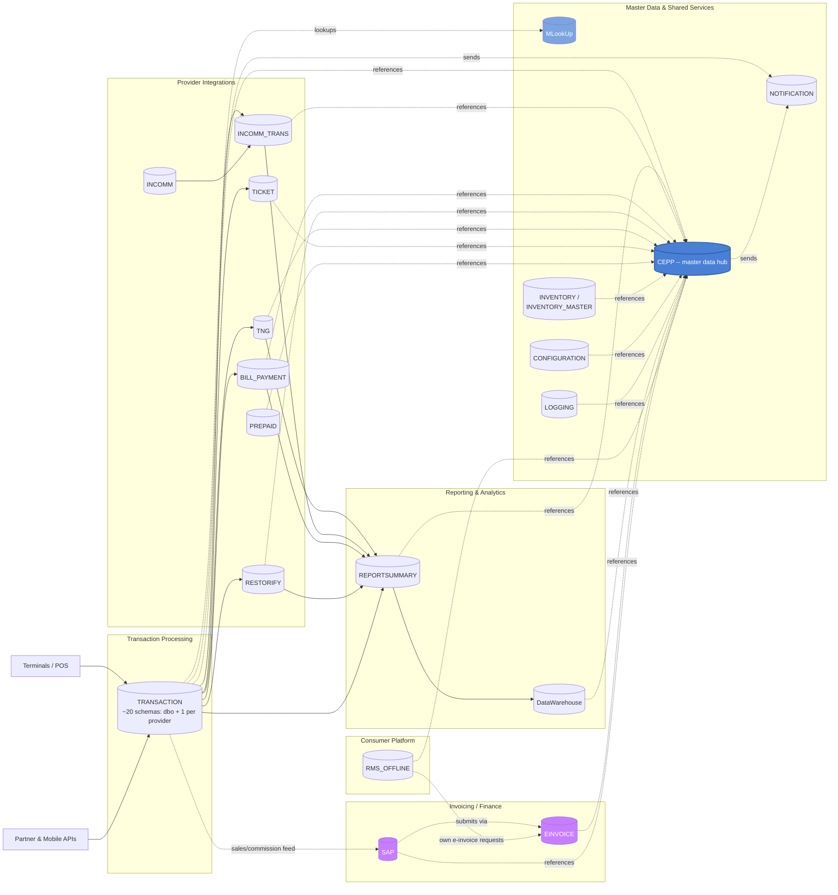

# reload_db — Database Estate Overview

This is a from-source trace of the `reload_db` SQL Server estate: one instance,
one database per business domain (not schemas-in-one-database). It starts from
the existing Obsidian vault (`Fiuu_Reload_DB_Vault_Code/`) but every module
below was cross-checked against the live patch scripts in
`reload_db/MAINT/<MODULE>/` — see [`vault-drift-notes.md`](vault-drift-notes.md)
for everywhere the two disagreed.

**Headline correction to the vault's own framing:** the vault's title claims
"16 separate databases." Live `MAINT/` has patch-script folders for **at least
18 real databases** — the vault's 16 plus **`EINVOICE`** and **`SAP`**, both of
which are genuine, actively-patched databases (`USE [EINVOICE]` / `USE [SAP]`
in their baseline scripts) with zero mentions anywhere in the vault, including
the 260KB `reload_schema.dbml`. See `vault-drift-notes.md` for the evidence.

## The database estate

| Database | MAINT folder | Tables (vault count, uncorrected) | Role |
|---|---|---|---|
| `CEPP` | `CEPP/` | 83 (+1 undercounted, see drift notes) | Master data & back-office admin hub: org hierarchy (Company → Dealers → Stores → Terminals), users/roles/permissions, product & service catalog, commission/settlement rules, shared reference data (`LookupCodes`, `Country`, `Currency`, `Regions`, `States`). The most cross-referenced database in the estate. |
| `TRANSACTION` | `TRANSACTION/` | 144 (schema count undercounted, see drift notes) | Core transaction staging + EOD/EOS reconciliation + one integration schema per external payment/reload provider. Every terminal/API reload or payment request lands here first. |
| `BILL_PAYMENT` | `BILL_PAYMENT/` | 54 | Bill-payment aggregator — one small schema per biller/partner (TNB, Telekom, Astro, Digi, IWK, UMOBILE, MBMB, Syabas, ATX, PayLink, MobilityOne, RazerPay, REDONE, EPay, Panda, IIMMPACT, AnyPay) plus a shared `TRANS` schema for orders/EOD/void. |
| `REPORTSUMMARY` | `REPORTSUMMARY/` | 40 | Settlement & billing-report aggregation — downstream of `TRANSACTION` and the provider DBs, one `*BillerReport`/`*SettlementReport` table per channel. |
| `RMS_OFFLINE` | `RMS_OFFLINE/` | 41 | Consumer-facing "Reload Offline" self-service web app: its own `Users`, `Partners`, `Products`, reward campaigns, payment transactions, CMS content (FAQ/Footer/HomePage), e-Invoice requests. Largely independent user base from CEPP. |
| `TNG` | `TNG/` | 22 | Touch 'n Go eWallet / prepaid card integration: accounts, wallets, card & fund transactions, host authentications, terminal batches. |
| `RESTORIFY` | `RESTORIFY/` | 22 | Carbon-offset / sustainability calculator product line: projects, batches, dealer subscription plans, calculator transactions, STACS carbon-checkout integration. |
| `INCOMM` | `INCOMM/` | 14 | InComm gift-card/stored-value program integration: application requests, transaction/transfer-value processing, retailer exception handling. |
| `INCOMM_TRANS` | `INCOMM_TRANS/` | 10 | Transaction-side companion to `INCOMM`: activation/deactivation, EOD/EOS, reversal operations. |
| `EINVOICE` | `EINVOICE/` | 3 (missing from vault entirely) | Malaysia e-Invoicing (MyInvois/LHDN) integration: `TRANS.Submissions` / `TRANS.Invoices` / `TRANS.InvoiceItems`, plus a `dbo` schema of cross-database reporting stored procedures. |
| `SAP` | `SAP/` | 2 (missing from vault entirely) | SAP Business One integration for e-Invoice document submission: `TRANS.Submissions` / `TRANS.SubmissionItems`, staged for SAP B1 posting (`CardCode`, `DocEntry`, `U_EIV_*` user-defined fields are SAP B1 vocabulary). |
| `DataWarehouse` | `DataWarehouse/` | 11 | Reporting star-schema (`DIM_DEALERS`, `DIM_PRODUCTS`, `DIM_SERVICEPROVIDER`, `DIM_WEEKS`, `FACT_DAILYSALES`) fed from CEPP master data and daily sales facts. |
| `NOTIFICATION` | `NOTIFICATION/` | 9 | Outbound messaging service: channels, subscribers, message delivery tracking. Unusually, has **no `StoredProcedure/` folder in MAINT at all** — see `notification.md`. |
| `INVENTORY_MASTER` | `INVENTORY_MASTER/` | 3 | Inventory master data (`Stocks`, `UploadingStocks`), referenced by `TRANSACTION` and `CEPP`. |
| `MLookUp` | `MLookUp/` | 5 | Small shared lookup-code store, queried cross-database like `CEPP` for shared reference values (region/currency/phone-book/IP-to-country lookups). |
| `PREPAID` | `PREPAID/` | 4 | Prepaid product registration/enrolment tracking. Legacy — day-to-day prepaid ("Pinless") sales actually live in `TRANSACTION.dbo`. |
| `CONFIGURATION` | `CONFIGURATION/` | 3 | Shared runtime configuration key/value store (`Config`/`ConfigDetails`/`CountrySettings`) used across the platform. |
| `TICKET` | `TICKET/` | 3 | Ticketing/voucher integration (Ticket2U) plus a shared `TRANS` schema for payment orders. |
| `INVENTORY` | `INVENTORY/` | 2 | Stock/inventory staging tables supporting the stock-order flow in `TRANSACTION`. |
| `LOGGING` | `LOGGING/` | 1 | Cross-application device/login audit trail (`DevicesLoginTrail`). |

That's **20 real, currently-patched business databases**, not 16.

## Non-database MAINT folders

Two more folders live under `reload_db/MAINT/` that are **not** business
databases and are intentionally not documented as modules here:

- **`SQLAgentJob/`** — not schema, but SQL Server Agent job definitions
  (`msdb.dbo.sp_add_job` scripts), named `[HHMM]<Frequency>.<Job>_<Verb>.sql`
  (e.g. `[0130]Daily.SalesTransactionReport_Ins.sql` fires
  `EXEC [REPORTSUMMARY].[dbo].[SalesTransactionReport_Ins]` at 13:00 daily).
  This is the orchestration layer that actually drives the
  `TRANSACTION → REPORTSUMMARY → DataWarehouse` batch flow shown below — worth
  knowing about even though it has no tables of its own. A `rmsp-dw/`
  subfolder holds a handful of similar jobs specific to the data-warehouse
  sync server (`[0200]DAILY.SALES.SYNC.sql`, `[30Mins]DAILY.STOCK.SYNC.sql`).
- **`CICDTest/`** — a scratch database used to validate the patch-deployment
  pipeline itself. Its `Table/` folder literally contains `tblLogin`,
  `tblLogin2`, `tblLogin3`, `tblLogin4` and bare `SQLQueryN.sql` files —
  developer smoke-test objects, not production schema. Mentioned here only so
  it isn't mistaken for a missed module.

Also present but out of scope for schema tracing: `reload_db/Console/Offline`
and `reload_db/Console/Reload` are compiled `SQLConsole.exe` deployment tools
(with matching `NLog.config`) — one per target environment — used to execute
the MAINT scripts against a live database. They ship as binaries only in this
checkout, so their internal apply-order logic wasn't reverse-engineered; see
`patch-script-conventions.md` for what can be inferred about the release
process from the script folders themselves.

## How MAINT maps to physical databases

The mapping is almost entirely 1:1 by name: `MAINT/<Name>/` patches the
database literally called `[<Name>]` (confirmed via the `USE [...]` /
`CREATE TABLE [<Name>].[schema].[table]` statements at the top of nearly every
script). The only naming wrinkle is capitalization/spacing (`EInvoice` inside
scripts vs `EINVOICE` as the folder/database name) and that a handful of
modules use a non-`dbo` primary schema (`TRANS` for `EINVOICE`, `SAP`,
`TICKET`, part of `RESTORIFY`/`BILL_PAYMENT`; `Ticket2U`/`STACS` for their
respective partner schema).

Within a module folder, objects are organized by **type**, not by feature or
release: `Table/`, `StoredProcedure/`, `Function/`, `Index/`, `Type/`,
`Schema/`, `Data/`, `DataReference/`, `Trigger/`, `View/`. A single business
change (e.g. "add a column and a proc to support it") therefore lands as two
separate files in two separate folders, tied together only by a shared ticket
number in the filename or header comment — see `patch-script-conventions.md`.

## The big picture

**Reading it:** same shape as the vault's original diagram, with `EINVOICE`
and `SAP` added as a third downstream leg alongside reporting. The
`SAP → EINVOICE` link is inferred from column vocabulary, not a proven FK: SAP's
`TRANS.Submissions` looks like the SAP Business One posting payload (`CardCode`,
`DocEntry`, `NumAtCard`, `U_EIV_*` user-defined fields are SAP B1's own naming
convention for custom fields), and EINVOICE's `TRANS.Submissions`/`TRANS.Invoices`
look like the actual MyInvois (Malaysia's LHDN e-Invoicing platform) submission
record — same domain (statutory e-invoicing), two different downstream systems
being fed from the same sales data. No stored procedure doing a live
`SAP.dbo...` ↔ `EINVOICE.dbo...` cross-database join was found in either
module's `StoredProcedure/` folder in the time available to verify this — flag
this relationship as **inferred from naming/business-domain, not confirmed by
code**, if it matters for anything you're about to change.

Solid arrows are the transactional flow (a reload/payment request lands in
`TRANSACTION`, gets routed to a provider-specific database, settlement rows
land in `REPORTSUMMARY`, which feeds `DataWarehouse`). Dashed arrows are
"references master/shared data in" — almost everything reads `CEPP`.

## Where to go next

- [`patch-script-conventions.md`](patch-script-conventions.md) — how MAINT
  scripts are versioned, named, and released.
- [`vault-drift-notes.md`](vault-drift-notes.md) — every place the vault
  disagreed with the live scripts.
- One doc per module (`cepp.md`, `transaction.md`, ... — see this folder).
- `diagrams/` — one Mermaid ER diagram per module, plus
  `diagrams/cross-module-relationships.md` for the handful of tables joined
  across module boundaries.

## Related

- [[architecture/reload_db/vault-drift-notes]] — everywhere this estate diverges from the original Obsidian vault
- [[architecture/reload_db/patch-script-conventions]] — how the MAINT scripts summarized here are versioned/named
- [[architecture/reload_db/cepp]] — the master-data hub referenced throughout this overview
- [[architecture/reload/01-overview]] — the application side that reads/writes this estate
- [[gitlab-analysis/reload_db-tribal-knowledge]] — which of these databases actually break/get patched most
