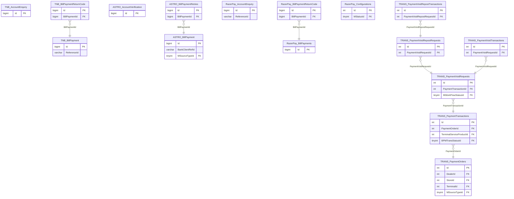

# BILL_PAYMENT — ER diagram

54 tables across 19 schemas. Per-biller schemas are structurally repetitive
(`AccountVerification` → `BillPayment`, occasionally + `BillPaymentRetries`/
`BillPaymentReturnCode`) so three representative billers plus the shared
`TRANS` workflow are shown; see `bill-payment.md` for the full schema list.

*(Entity names are prefixed `Schema_Table` — Mermaid `erDiagram` doesn't
allow dots in identifiers.)*
