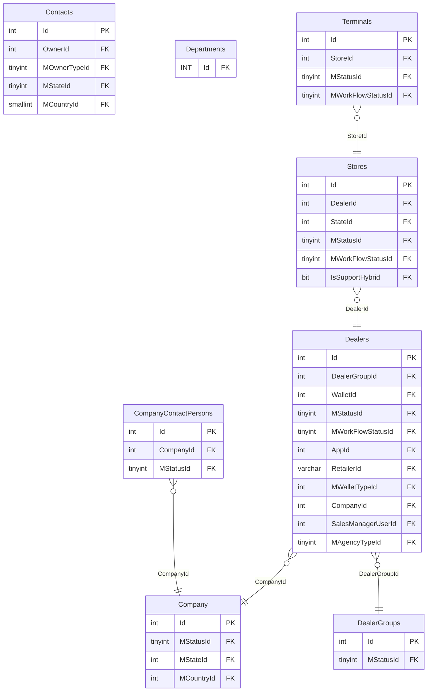
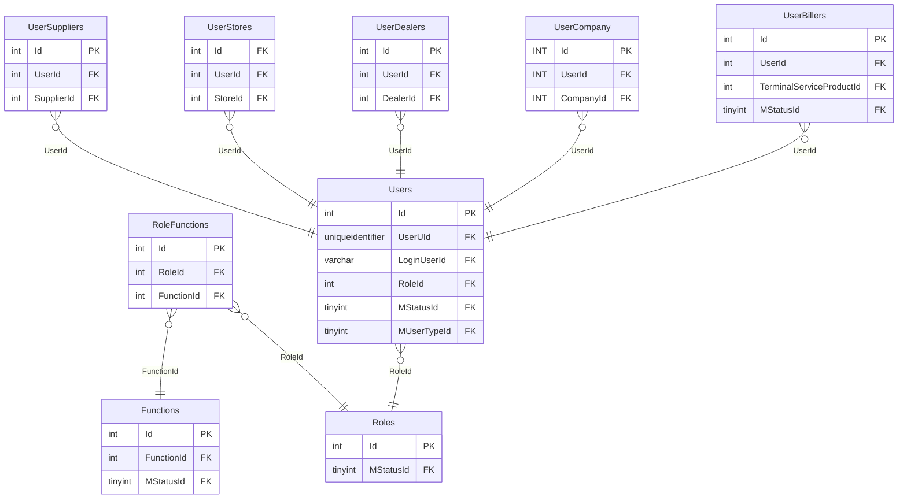
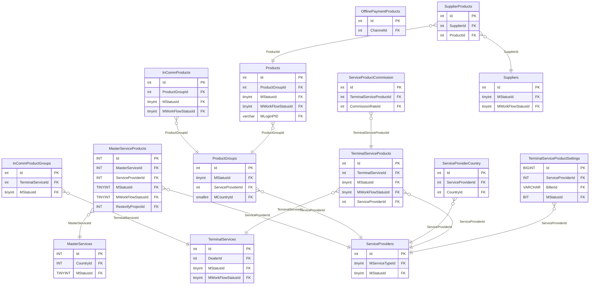
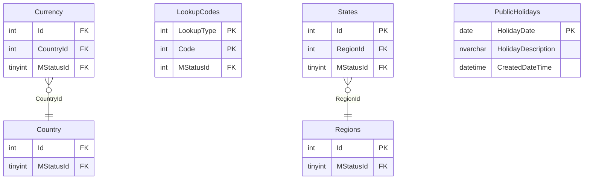
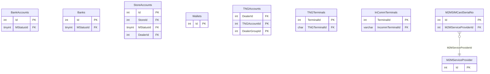
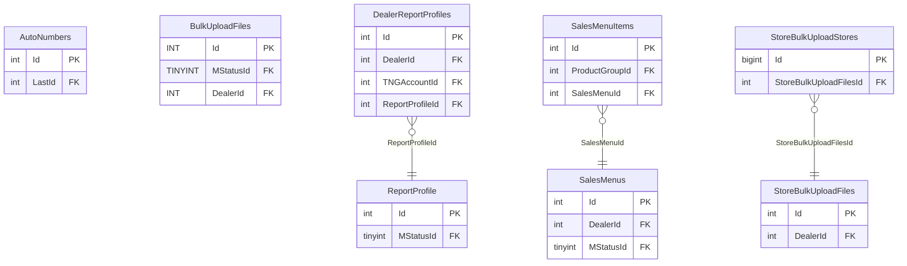

# CEPP — ER diagrams

CEPP has 84 tables (83 + `PublicHolidays`, missing from the vault — see
`vault-drift-notes.md`) — too many for one legible diagram, so it's split
into the same functional clusters used in `cepp.md`. All PK/FK annotations
below were spot-checked against `reload_db/MAINT/CEPP/Table/*.sql`.

## Org hierarchy

## Users & access

## Product & service catalog

*(`MasterServiceProducts.RestorifyProjectId` is the cross-database link into
`RESTORIFY.dbo.Projects` — see `diagrams/cross-module-relationships.md`.)*

## Commission & settlement

```mermaid
erDiagram
    CommissionRate {
        int Id PK
        tinyint MStatusId FK
        tinyint MWorkFlowStatusId FK
    }
    DealerCommissionPackages {
        bigint Id PK
        int DealerId FK
        bigint SaleCommissionId FK
    }
    DealerGroupSAPItemCode {
        INT Id PK
        INT DealerGroupId FK
        INT ProductId FK
    }
    DealerMaterials {
        int Id PK
        int ProductGroupId FK
        int DealerId FK
        int TerminalServiceProductId FK
    }
    SaleCommissionMarginRates {
        bigint Id PK
        bigint SaleCommissionId FK
        int ServiceTypeId FK
        int ProductGroupId FK
        int ProductItemId FK
        int MarginTypeId FK
        int CommissionTypeId FK
        tinyint MStatusId FK
    }
    SaleCommissionMargins {
        int Id PK
        int ServiceTypeId FK
    }
    SaleCommissionRates {
        int Id PK
        int SaleCommissionMarginsId FK
        int DealerId FK
    }
    SaleCommissions {
        bigint Id PK
        tinyint MStatusId FK
        tinyint MWorkFlowStatusId FK
    }
    Settlement {
        INT Id PK
        INT DealerId FK
        TINYINT MServiceTypeId FK
        INT ProductGroupTypeId FK
        TINYINT MFrequencyTypeId FK
        TINYINT MSettlementReportTypeId FK
    }
    SevenEChannelCommissionRate {
        INT Id PK
        INT ProductId FK
        TINYINT MTypeId FK
    }
    SevenECommissionRate {
        INT Id PK
        INT SevenEProductID FK
        TINYINT MTypeId FK
    }
    SevenEMaterial {
        INT Id PK
        INT SevenEProductId FK
        INT TerminalServiceProductId FK
    }
    SevenEProduct {
        INT Id PK
    }
    SevenESAPAccount {
        INT Id PK
        INT SevenEProductID FK
    }
    DealerCommissionPackages }o--|| SaleCommissions : "SaleCommissionId"
    SaleCommissionMarginRates }o--|| SaleCommissions : "SaleCommissionId"
    SaleCommissionRates }o--|| SaleCommissionMargins : "SaleCommissionMarginsId"
    SevenECommissionRate }o--|| SevenEProduct : "SevenEProductID"
    SevenEMaterial }o--|| SevenEProduct : "SevenEProductId"
    SevenESAPAccount }o--|| SevenEProduct : "SevenEProductID"
```

## Geography & reference (includes `PublicHolidays`, missing from vault)

## Banking, wallets & TNG/InComm hardware

## Sales & reporting ops

