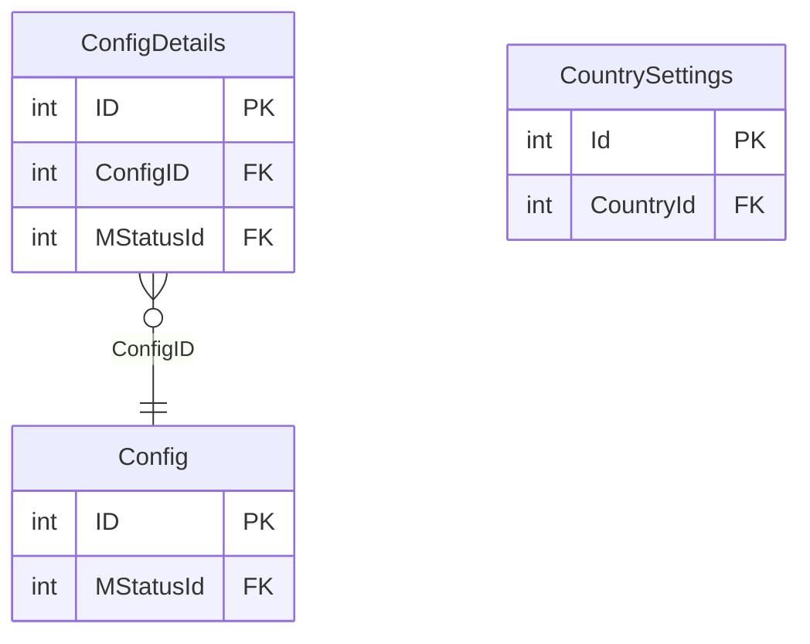

# CONFIGURATION — ER diagram

3 tables, one `dbo` schema.

*(`RMS_OFFLINE.dbo` has its own separately-defined `Config`/`ConfigDetails`
pair with a near-identical shape — not the same physical tables. See
`configuration.md`.)*
