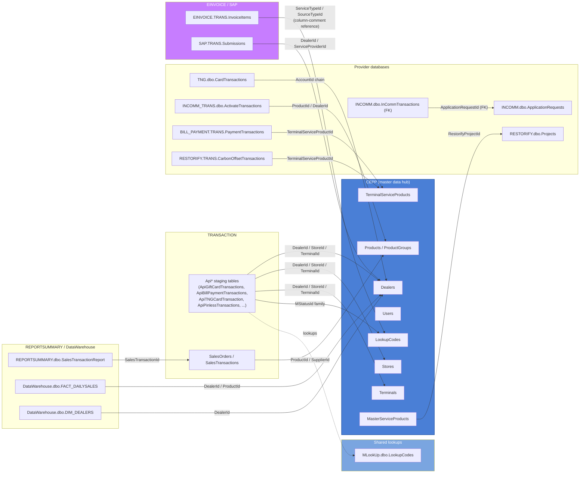

# Cross-module relationships

The handful of tables that actually get referenced *across* database
boundaries — as opposed to within a single module, which is what each
module's own `<module>-er.md` diagram covers. Every arrow here is an
inferred-by-naming-convention relationship (three-part cross-database SQL
like `[CEPP].[dbo].[LookupCodes]`) unless marked **(FK)** for one of the 6
real, database-enforced foreign keys in the whole estate. Arrows point from
the referencing table to the table it references.

## Reading this diagram

- **`Dealers`/`Stores`/`Terminals`** (all `CEPP.dbo`) are the single most
  cross-referenced entities in the estate — nearly every transaction/staging
  table in every module carries `DealerId`/`StoreId`/`TerminalId` columns
  pointing back at them. This diagram collapses that into one arrow per
  module rather than drawing every individual table, or it would be
  unreadable — see each module's own ER diagram for the full column-level
  detail.
- **`LookupCodes`** is deliberately shown twice — `CEPP.dbo.LookupCodes` is
  the primary shared enum table referenced from nearly everywhere, but
  several modules (`TNG`, `RMS_OFFLINE`, `INCOMM`, `NOTIFICATION`, `MLookUp`
  itself) keep their **own separate, physically distinct** `LookupCodes`
  table rather than only reading CEPP's. `MLookUp.dbo.LookupCodes` is shown
  here specifically because it's the one other module's copy that the
  top-level architecture diagram calls out as cross-referenced by
  `TRANSACTION`.
- **`INCOMM.dbo.InCommTransactions → ApplicationRequests`** is one of only 6
  real, SQL-enforced foreign keys in the entire 470-table estate (per the
  vault's methodology notes) — everything else on this page, and in every
  module doc, is inferred from naming convention plus corroborating
  cross-database SQL found in the application code, not database-enforced.
- **`MasterServiceProducts.RestorifyProjectId → RESTORIFY.dbo.Projects`** is
  the one clear case of `CEPP` reaching *into* a provider database rather
  than the reverse — CEPP is the hub for almost everything else.
- **`SAP.TRANS.Submissions` and `EINVOICE.TRANS.Invoices`/`Submissions`** are
  not shown linked to each other here because no verified join was found
  between them — see `00-overview.md`, `einvoice.md`, and `sap.md` for why
  they're suspected to be parallel, not chained.
