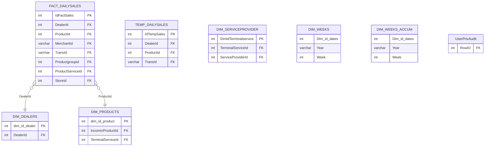

# DataWarehouse — ER diagram

11 tables, one `dbo` schema — a star schema.

*(`TEMP_DAILYSALES` is the ETL staging copy `DW_SYNC_DATA*` procedures load
before merging into `FACT_DAILYSALES` — see `datawarehouse.md`.
`pinless_storeid_20212021`/`reload_sto_reid2021`/`UserPrivAudit2` are
one-off/ad-hoc tables omitted here; flagged, not modeled, in the module doc.)*
