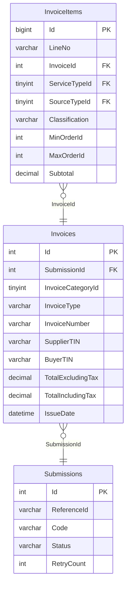

# EINVOICE — ER diagram

3 tables, `TRANS` schema. **Entirely missing from the vault** — this diagram
is built directly from `reload_db/MAINT/EINVOICE/Table/*.sql`, not adapted
from any existing vault diagram. See `einvoice.md` and `vault-drift-notes.md` §1.

`InvoiceItems.ServiceTypeId`/`SourceTypeId` reference `CEPP.dbo.LookupCodes`
by explicit column-level comment in the source script — the one confirmed
cross-database link out of this database. `Invoices.InvoiceNumber` is
computed by an `AFTER INSERT` trigger from `InvoiceCategoryId`+`InvoiceType`
via 6 dedicated SQL `SEQUENCE` objects, not by application code — see
`einvoice.md` for the full numbering scheme.
