# INCOMM — ER diagram

14 tables, one `dbo` schema.

```mermaid
erDiagram
    ApplicationRequests {
        bigint Id PK
        int MActionTypeId FK
        int ApplicationId FK
        int MRequestStageId FK
        int MRequestStatusId FK
    }
    InCommTransactions {
        bigint Id PK
        bigint ApplicationRequestId FK
        varchar AuthorizationId FK
    }
    RTGRequests {
        int Id PK
        int AppId FK
        tinyint MPointOfServiceId FK
        tinyint MActionTypeId FK
    }
    RTGTransactions {
        int Id PK
        int RTGRequestId FK
        varchar AuthorizationId FK
    }
    RTGCancellations {
        int Id PK
        int RTGRequestId FK
        varchar AuthorizationId FK
    }
    TransferValueRequests {
        bigint Id PK
        int ApplicationId FK
        int MActionTypeId FK
    }
    TransferValueInCommTransactions {
        bigint Id PK
        bigint TransferValueRequestsId FK
        varchar OriginStoreId FK
    }
    TransferValueHistoryInquiries {
        bigint Id PK
        bigint TransferValueRequestsId FK
    }
    TransferValueTransactionInquiries {
        int Id PK
        int ApplicationId FK
    }
    RetailerExceptionFiles {
        int Id PK
        int MStatusId FK
    }
    RetailerExceptionDetails {
        bigint Id PK
        int RetailerExceptionFileId FK
    }
    ApiSettings {
        int Id PK
    }
    HealthMonitor {
        int Id PK
    }
    LookupCodes {
        int LookupType PK
        int Code PK
    }

    InCommTransactions }o--|| ApplicationRequests : "ApplicationRequestId (FK, enforced)"
    RTGCancellations }o--|| RTGRequests : "RTGRequestId"
    RTGTransactions }o--|| RTGRequests : "RTGRequestId"
    TransferValueHistoryInquiries }o--|| TransferValueRequests : "TransferValueRequestsId"
    TransferValueInCommTransactions }o--|| TransferValueRequests : "TransferValueRequestsId"
    RetailerExceptionDetails }o--|| RetailerExceptionFiles : "RetailerExceptionFileId"
```

*(`InCommTransactions → ApplicationRequests` is one of only 6 real,
database-enforced foreign keys in the entire estate — everything else on
this page is inferred by naming convention.)*
