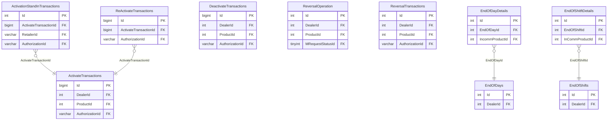

# INCOMM_TRANS — ER diagram

10 tables, one `dbo` schema.

```mermaid
erDiagram
    ActivateTransactions {
        bigint Id PK
        int DealerId FK
        int ProductId FK
        varchar AuthorizationId FK
    }
    ActivationStandInTransactions {
        int Id PK
        bigint ActivateTransactionId FK
        varchar RetailerId FK
        varchar AuthorizationId FK
    }
    ReActivateTransactions {
        bigint Id PK
        bigint ActivateTransactionId FK
        varchar AuthorizationId FK
    }
    DeactivateTransactions {
        bigint Id PK
        int DealerId FK
        int ProductId FK
        varchar AuthorizationId FK
    }
    ReversalOperation {
        int Id PK
        int DealerId FK
        int ProductId FK
        tinyint MRequestStatusId FK
    }
    ReversalTransactions {
        int Id PK
        int DealerId FK
        int ProductId FK
        varchar AuthorizationId FK
    }
    EndOfDays {
        int Id PK
        int DealerId FK
    }
    EndOfDayDetails {
        int Id PK
        int EndOfDayId FK
        int IncommProductId FK
    }
    EndOfShifts {
        int Id PK
        int DealerId FK
    }
    EndOfShitftDetails {
        int Id PK
        int EndOfShiftId FK
        int InCommProductId FK
    }

    ActivationStandInTransactions }o--|| ActivateTransactions : "ActivateTransactionId"
    ReActivateTransactions }o--|| ActivateTransactions : "ActivateTransactionId"
    EndOfDayDetails }o--|| EndOfDays : "EndOfDayId"
    EndOfShitftDetails }o--|| EndOfShifts : "EndOfShiftId"
```

*(`EndOfShitftDetails` is the actual live table name — typo reproduced
faithfully, not a transcription error.)*
