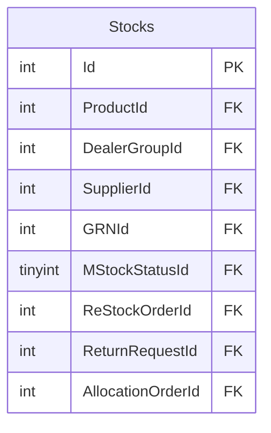

# INVENTORY — ER diagram

2 tables, one `dbo` schema.

*(A single table, but with 84 stored procedures against it — the highest
procedure-to-table ratio in the estate. `ReStockOrderId`/`ReturnRequestId`/
`AllocationOrderId` all point at `TRANSACTION.dbo` tables — see
`inventory.md`. Compare with the similarly-named but separate
`INVENTORY_MASTER.dbo.Stocks`.)*
