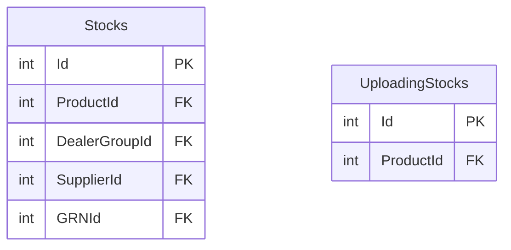

# INVENTORY_MASTER — ER diagram

3 tables, one `dbo` schema.

*(No relationships found between `Stocks` and `UploadingStocks` themselves —
`UploadingStocks` is a staging table that presumably feeds `Stocks` via
application code, not a declared FK-by-convention link. See
`inventory-master.md` for the distinction from `INVENTORY.dbo.Stocks`.)*
