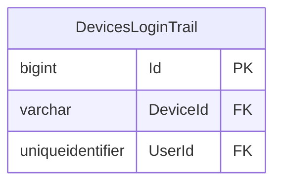

# LOGGING — ER diagram

1 table, one `dbo` schema — the smallest database in the estate.

*(`UserId`'s type, `uniqueidentifier`, matches `CEPP.dbo.Users.UserUId`
rather than `CEPP.dbo.Users.Id` — see `logging.md`.)*
