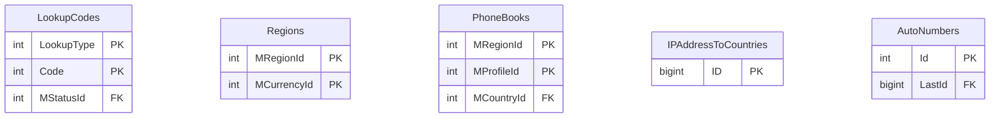

# MLookUp — ER diagram

5 tables, one `dbo` schema. No relationships between the tables — each is an
independent lookup keyed on its own composite key.

*(This `LookupCodes`/`Regions` are physically separate tables from
`CEPP.dbo.LookupCodes`/`CEPP.dbo.Regions` — same names, different databases.
See `diagrams/cross-module-relationships.md`.)*
