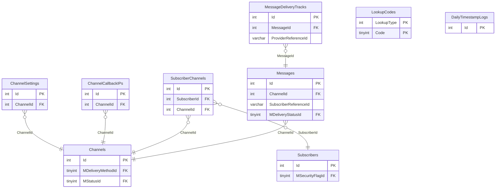

# NOTIFICATION — ER diagram

9 tables, one `dbo` schema.

*(No `StoredProcedure/` folder exists for this module in `MAINT/` even
though real procedures back every table above — see `notification.md` and
`vault-drift-notes.md` §4.)*
