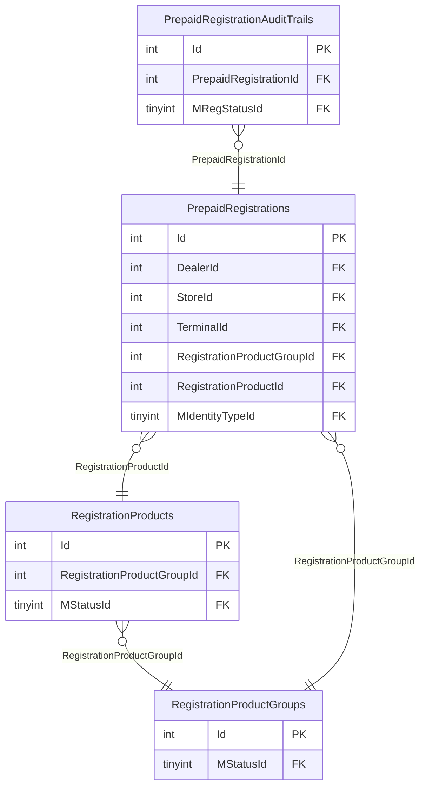

# PREPAID — ER diagram

4 tables, one `dbo` schema.

```mermaid
erDiagram
    RegistrationProductGroups {
        int Id PK
        tinyint MStatusId FK
    }
    RegistrationProducts {
        int Id PK
        int RegistrationProductGroupId FK
        tinyint MStatusId FK
    }
    PrepaidRegistrations {
        int Id PK
        int DealerId FK
        int StoreId FK
        int TerminalId FK
        int RegistrationProductGroupId FK
        int RegistrationProductId FK
        tinyint MIdentityTypeId FK
    }
    PrepaidRegistrationAuditTrails {
        int Id PK
        int PrepaidRegistrationId FK
        tinyint MRegStatusId FK
    }

    RegistrationProducts }o--|| RegistrationProductGroups : "RegistrationProductGroupId"
    PrepaidRegistrations }o--|| RegistrationProductGroups : "RegistrationProductGroupId"
    PrepaidRegistrations }o--|| RegistrationProducts : "RegistrationProductId"
    PrepaidRegistrationAuditTrails }o--|| PrepaidRegistrations : "PrepaidRegistrationId"
```
