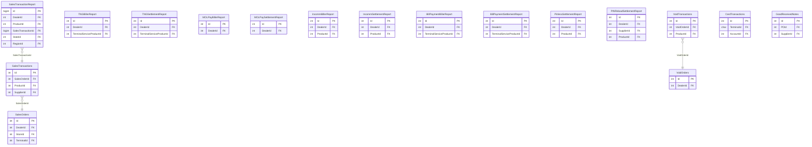

# REPORTSUMMARY - ER diagram

40 tables, one `dbo` schema. Grouped by the channel/feature clusters used in
the module doc.

```mermaid
erDiagram
    SalesOrders {
        int Id PK
        int DealerId FK
        int StoreId FK
        int TerminalId FK
    }
    SalesTransactions {
        int Id PK
        int SalesOrderId FK
        int ProductId FK
        int SupplierId FK
    }
    SalesTransactionReport {
        bigint Id PK
        int DealerId FK
        int ProductId FK
        bigint SalesTransactionId FK
        int StateId FK
        int RegionId FK
    }
    TNGBillerReport {
        int Id PK
        int DealerId FK
        int TerminalServiceProductId FK
    }
    TNGSettlementReport {
        int Id PK
        int DealerId FK
        int TerminalServiceProductId FK
    }
    MOLPayBillerReport {
        int Id PK
        int DealerId FK
    }
    MOLPaySettlementReport {
        int Id PK
        int DealerId FK
    }
    IncommBillerReport {
        int Id PK
        int DealerId FK
        int ProductId FK
    }
    IncommSettlementReport {
        int Id PK
        int DealerId FK
        int ProductId FK
    }
    BillPaymentBillerReport {
        int Id PK
        int DealerId FK
        int TerminalServiceProductId FK
    }
    BillPaymentSettlementReport {
        int Id PK
        int DealerId FK
        int TerminalServiceProductId FK
    }
    PinlessSettlementReport {
        int Id PK
        int DealerId FK
        int ProductId FK
    }
    PINReloadSettlementReport {
        int Id PK
        int DealerId FK
        int SupplierId FK
        int ProductId FK
    }
    VoidOrders {
        int Id PK
        int DealerId FK
    }
    VoidTransactions {
        int Id PK
        int VoidOrderId FK
        int ProductId FK
    }
    CardTransactions {
        int Id PK
        char TerminalId FK
        int AccountId FK
    }
    GoodReceivedNotes {
        int Id PK
        int POId FK
        int SupplierId FK
    }
    SalesTransactionReport }o--|| SalesTransactions : "SalesTransactionId"
    SalesTransactions }o--|| SalesOrders : "SalesOrderId"
    VoidTransactions }o--|| VoidOrders : "VoidOrderId"
```
