# RESTORIFY — ER diagram

22 tables across `dbo`, `STACS`, `TRANS`.

```mermaid
erDiagram
    Projects {
        int Id PK
        nvarchar UUID FK
        int CountryId FK
        int ProjectTypeId FK
    }
    ProjectTypes {
        int Id PK
    }
    ProjectBatches {
        int Id PK
        int ProjectId FK
        tinyint MStatusId FK
    }
    ProjectBatchBalances {
        int Id PK
        int ProjectBatchId FK
    }
    CalculatorLevel1Categories {
        int Id PK
    }
    CalculatorLevel2Categories {
        int Id PK
        int CalculatorLevel1CategoryId FK
    }
    CalculatorSettingsPriceBased {
        int Id PK
        int CalculatorLevel1CategoryId FK
    }
    CalculatorSettingsWeightBased {
        int Id PK
        int CalculatorLevel2CategoryId FK
    }
    CalculatorSubscriptionPlans {
        int Id PK
        tinyint SubscriptionPlanTypeId FK
    }
    CalculatorDealerSubscriptionPlans {
        int Id PK
        int DealerId FK
    }
    CalculatorDealerSubscriptionBalances {
        int Id PK
        int CalculatorDealerSubscriptionPlanId FK
    }
    STACS_CarbonCheckout {
        int Id PK
        nvarchar OrderId
        nvarchar ProjectUuid
        int RMSMerchantId FK
        varchar CarbonCertificateId
    }
    TRANS_CalculatorTransactions {
        int Id PK
        nvarchar ReferenceId
        int TerminalId FK
        int CalculatorDealerSubscriptionPlanId FK
        int CalculatorLevel2CategoryId FK
    }
    TRANS_CalculatorBulkTransactions {
        int Id PK
        int CalculatorDealerSubscriptionPlanId FK
        int BulkUploadFileId FK
        int CalculatorLevel2CategoryId FK
    }
    TRANS_CalculatorSubscriptionPayments {
        int Id PK
        varchar ReferenceId
        int DealerId FK
        int CalculatorDealerSubscriptionPlanId FK
    }
    TRANS_CarbonOffsetTransactions {
        int Id PK
        nvarchar ReferenceId
        int TerminalId FK
        nvarchar CarbonCertificateId
    }
    TRANS_ProjectBatchTransactions {
        int Id PK
        int ProjectBatchId FK
        nvarchar ReferenceId
    }

    ProjectBatches }o--|| Projects : "ProjectId"
    Projects }o--|| ProjectTypes : "ProjectTypeId"
    ProjectBatchBalances }o--|| ProjectBatches : "ProjectBatchId"
    CalculatorLevel2Categories }o--|| CalculatorLevel1Categories : "CalculatorLevel1CategoryId"
    CalculatorSettingsPriceBased }o--|| CalculatorLevel1Categories : "CalculatorLevel1CategoryId"
    CalculatorSettingsWeightBased }o--|| CalculatorLevel2Categories : "CalculatorLevel2CategoryId"
    CalculatorDealerSubscriptionPlans }o--|| CalculatorSubscriptionPlans : "SubscriptionPlanTypeId"
    CalculatorDealerSubscriptionBalances }o--|| CalculatorDealerSubscriptionPlans : "CalculatorDealerSubscriptionPlanId"
    TRANS_CalculatorTransactions }o--|| CalculatorDealerSubscriptionPlans : "CalculatorDealerSubscriptionPlanId"
    TRANS_ProjectBatchTransactions }o--|| ProjectBatches : "ProjectBatchId"
```

*(`Projects.Id` is also the target of `CEPP.dbo.MasterServiceProducts.RestorifyProjectId`
— the one place CEPP reaches into a provider database; see
`diagrams/cross-module-relationships.md`.)*
