# RMS_OFFLINE — ER diagram

41 tables, one `dbo` schema. Split by the functional clusters used in
`rms-offline.md`.

```mermaid
erDiagram
    Users {
        uniqueidentifier Id PK
        bigint PartnerId FK
        bigint CountryId FK
    }
    UserExternalLogins {
        varchar LoginProvider PK
        varchar ProviderKey PK
        uniqueidentifier UserId FK
    }
    Partners {
        bigint Id PK
        varchar MOLPayMerchantId FK
    }
    PartnerProducts {
        bigint Id FK
        bigint PartnerId FK
        bigint ProductGroupId FK
        bigint ProductId FK
    }
    PartnerPurchase {
        bigint Id PK
        varchar ReferenceId
        bigint PartnerId FK
        bigint TransactionDetailsId FK
    }
    PartnerServiceCharges {
        bigint Id FK
        bigint PartnerId FK
        bigint PaymentOptionId FK
    }
    PaymentOptions {
        bigint Id PK
    }
    Services {
        bigint Id PK
        int ServiceTypeId FK
    }
    ServiceTypes {
        int Id PK
    }
    ProductGroups {
        bigint Id PK
        bigint ServiceId FK
    }
    Products {
        bigint Id PK
        bigint ProductGroupId FK
        int CountryId FK
    }
    PaymentTransactions {
        bigint Id PK
        varchar MOLPayTransId FK
        int PaymentChannelId FK
    }
    TransactionDetails {
        bigint Id PK
        bigint PaymentTransactionId FK
        int ServiceTypeId FK
        bigint ProductId FK
        uniqueidentifier UserId FK
        bigint ProductGroupId FK
    }
    RetryTransactions {
        bigint Id FK
        tinyint ServiceTypeId FK
    }
    EInvoiceRequests {
        bigint Id FK
        varchar ReferenceId
    }
    RewardCampaigns {
        int Id PK
        int RewardChannelId FK
        int CountryId FK
    }
    RewardCampaignsPlatform {
        int Id PK
        int RewardCampaignId FK
        bigint PartnerId FK
    }
    RewardCampaignsProduct {
        int Id PK
        int RewardCampaignId FK
        bigint ProductGroupId FK
        bigint ProductId FK
    }
    RewardCampaignsCap {
        int Id PK
        int RewardCampaignId FK
    }
    RewardCampaignsCapBalance {
        int Id PK
        int RewardCampaignCapId FK
        varchar UserId FK
    }
    RewardCampaignsTransaction {
        bigint Id PK
        varchar ReferenceId
        int RewardCampaignsPlatformId FK
        int RewardCampaignProductId FK
        varchar UserId FK
    }

    UserExternalLogins }o--|| Users : "UserId"
    PartnerProducts }o--|| Partners : "PartnerId"
    PartnerPurchase }o--|| Partners : "PartnerId"
    PartnerServiceCharges }o--|| Partners : "PartnerId"
    PartnerServiceCharges }o--|| PaymentOptions : "PaymentOptionId"
    ProductGroups }o--|| Services : "ServiceId"
    Products }o--|| ProductGroups : "ProductGroupId"
    Services }o--|| ServiceTypes : "ServiceTypeId"
    TransactionDetails }o--|| ServiceTypes : "ServiceTypeId"
    TransactionDetails }o--|| Products : "ProductId"
    TransactionDetails }o--|| Users : "UserId"
    TransactionDetails }o--|| ProductGroups : "ProductGroupId"
    RetryTransactions }o--|| ServiceTypes : "ServiceTypeId"
    RewardCampaignsCap }o--|| RewardCampaigns : "RewardCampaignId"
    RewardCampaignsPlatform }o--|| RewardCampaigns : "RewardCampaignId"
    RewardCampaignsProduct }o--|| RewardCampaigns : "RewardCampaignId"
    RewardCampaignsCapBalance }o--|| RewardCampaignsCap : "RewardCampaignCapId"
    RewardCampaignsTransaction }o--|| RewardCampaignsPlatform : "RewardCampaignsPlatformId"
```

*(CMS-only tables — `FAQCategory`/`FAQDetails`, `FooterCategory`/
`FooterDetails`, `HomePageDetails`, `MaintenanceNoticeDetails`,
`SupportCategory`/`SupportDetails`, `EmailTemplate` — are omitted here as
they carry no cross-table relationships; see `rms-offline.md`.)*
