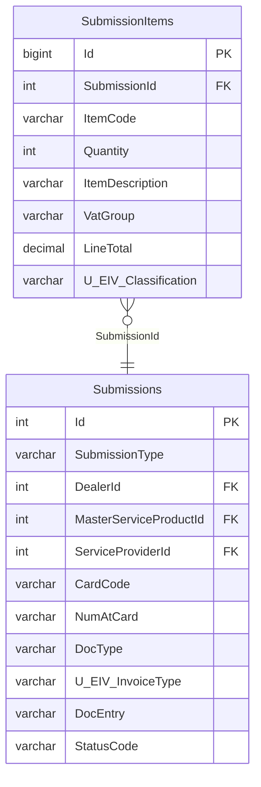

# SAP — ER diagram

2 tables, `TRANS` schema. **Entirely missing from the vault** — this diagram
is built directly from `reload_db/MAINT/SAP/Table/*.sql`, not adapted from
any existing vault diagram. See `sap.md` and `vault-drift-notes.md` §1.

`Submissions.DealerId`/`MasterServiceProductId`/`ServiceProviderId` reference
`CEPP`. The `CardCode`/`DocEntry`/`U_EIV_*` columns are SAP Business One's
own vocabulary (business-partner code, SAP document entry number, and
user-defined fields) — this table is staging data for a document to be
posted into SAP B1, not a Fiuu-native design. See `sap.md` for the suspected
(unconfirmed) relationship to the `EINVOICE` database's near-identical
`Submissions`/`U_EIV_*` shape.
