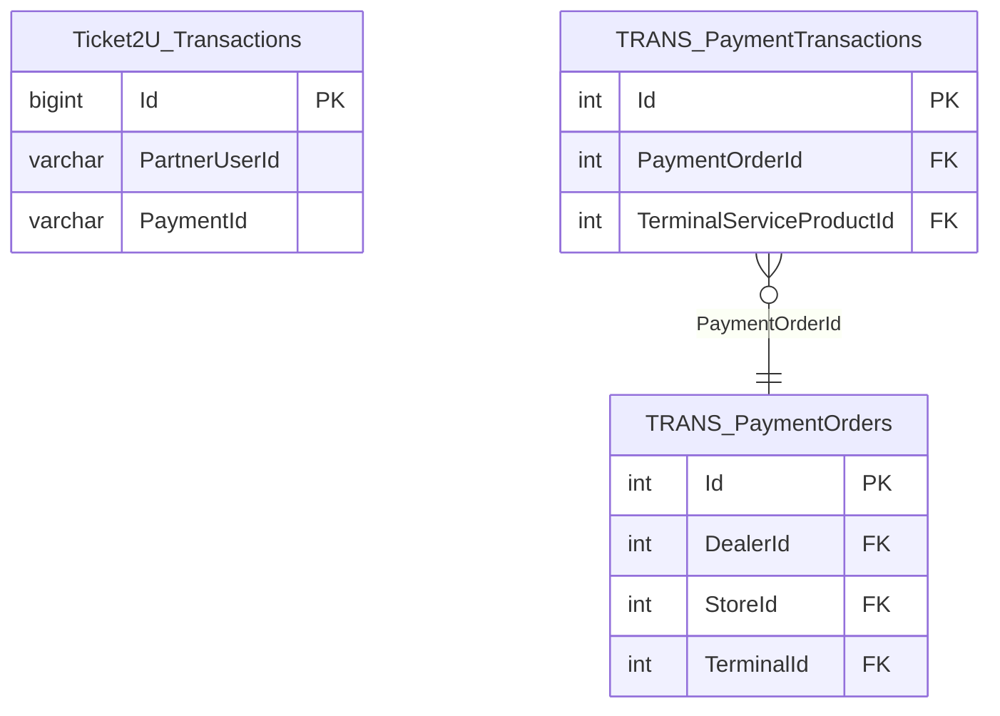

# TICKET — ER diagram

3 tables across `Ticket2U` and `TRANS` schemas.

*(Entity names prefixed `Schema_Table` — Mermaid `erDiagram` doesn't allow
dots in identifiers. `TRANS.PaymentOrders`/`PaymentTransactions` here is the
same reusable shape as `BILL_PAYMENT.TRANS` — independently defined, not a
shared physical table.)*
