# TNG — ER diagram

22 tables, one `dbo` schema.

```mermaid
erDiagram
    Accounts {
        int Id PK
        tinyint MStatusId FK
    }
    AccountBanks {
        int AccountId PK
        int BankId FK
    }
    AccountServiceProviders {
        int AccountId PK
        char SpId FK
    }
    AccountWallets {
        int AccountId PK
        int WalletId FK
    }
    Banks {
        int Id PK
    }
    Wallets {
        int Id PK
    }
    CardTransactions {
        int Id PK
        char TerminalId FK
        char SpId FK
        int AccountId FK
        int MTransTypeId FK
    }
    CardTransactionBatches {
        int CardTransactionId PK
    }
    CardTransactionBatchSummary {
        int Id PK
        int AccountId FK
    }
    FundTransactions {
        int Id PK
        int AccountId FK
        int WalletId FK
        tinyint MTransTypeId FK
    }
    FundAssignments {
        int Id PK
        int AccountId FK
        int WalletId FK
        int BankId FK
    }
    ReloadFundRequests {
        int Id PK
        int AccountId FK
        int WalletId FK
        char TerminalId FK
    }
    BalanceReconciliationLog {
        INT Id FK
        INT FundTransactionId FK
        INT WalletId FK
    }
    HostAuthentications {
        int Id PK
        char TerminalId FK
        int AccountId FK
    }
    BlacklistCards {
        int Id PK
        char TerminalId FK
        int AccountId FK
    }
    BlacklistCardBatches {
        int BlacklistCardId PK
    }
    TerminalBatches {
        int Id PK
        char TerminalId FK
    }
    TerminalSummary {
        int Id PK
        char TerminalId FK
        int AccountId FK
    }
    ServiceProviders {
        int Id PK
        char SpId FK
    }
    ServiceProviderSecretKeys {
        int Id PK
        char SpId FK
    }
    LookupCodes {
        int LookupType PK
        int Code PK
    }

    CardTransactionBatches }o--|| CardTransactions : "CardTransactionId"
    CardTransactions }o--|| Accounts : "AccountId"
    AccountBanks }o--|| Accounts : "AccountId"
    AccountBanks }o--|| Banks : "BankId"
    AccountServiceProviders }o--|| Accounts : "AccountId"
    AccountWallets }o--|| Accounts : "AccountId"
    AccountWallets }o--|| Wallets : "WalletId"
    BalanceReconciliationLog }o--|| FundTransactions : "FundTransactionId"
    BalanceReconciliationLog }o--|| Wallets : "WalletId"
    BlacklistCardBatches }o--|| BlacklistCards : "BlacklistCardId"
    BlacklistCards }o--|| Accounts : "AccountId"
    CardTransactionBatchSummary }o--|| Accounts : "AccountId"
    FundAssignments }o--|| Accounts : "AccountId"
    FundAssignments }o--|| Wallets : "WalletId"
    FundAssignments }o--|| Banks : "BankId"
    FundTransactions }o--|| Accounts : "AccountId"
    FundTransactions }o--|| Wallets : "WalletId"
    HostAuthentications }o--|| Accounts : "AccountId"
    ReloadFundRequests }o--|| Accounts : "AccountId"
    ReloadFundRequests }o--|| Wallets : "WalletId"
    TerminalSummary }o--|| Accounts : "AccountId"
```

*(TNG hardware/account-provisioning tables — `TNGAccounts`, `TNGTerminals`,
`TNGReaderModel`, etc. — live in `CEPP.dbo`, not here. See `cepp.md` and
`diagrams/cepp-er.md`'s "Banking, wallets & TNG/InComm hardware" cluster.)*
