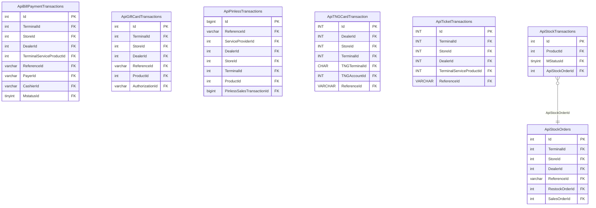
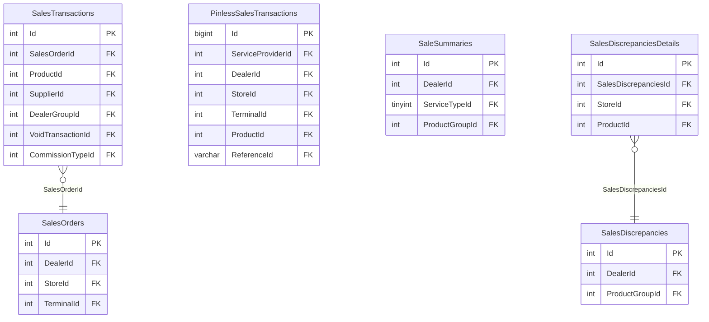
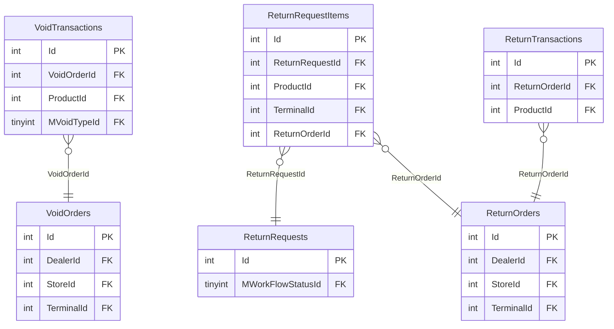
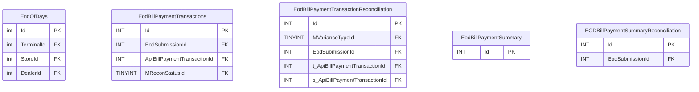
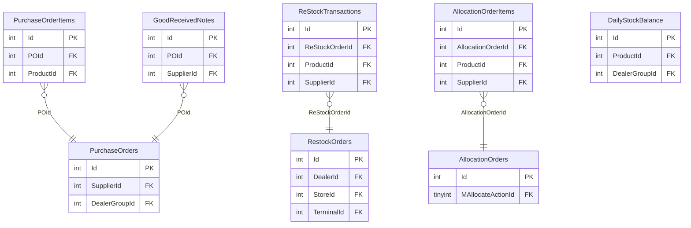
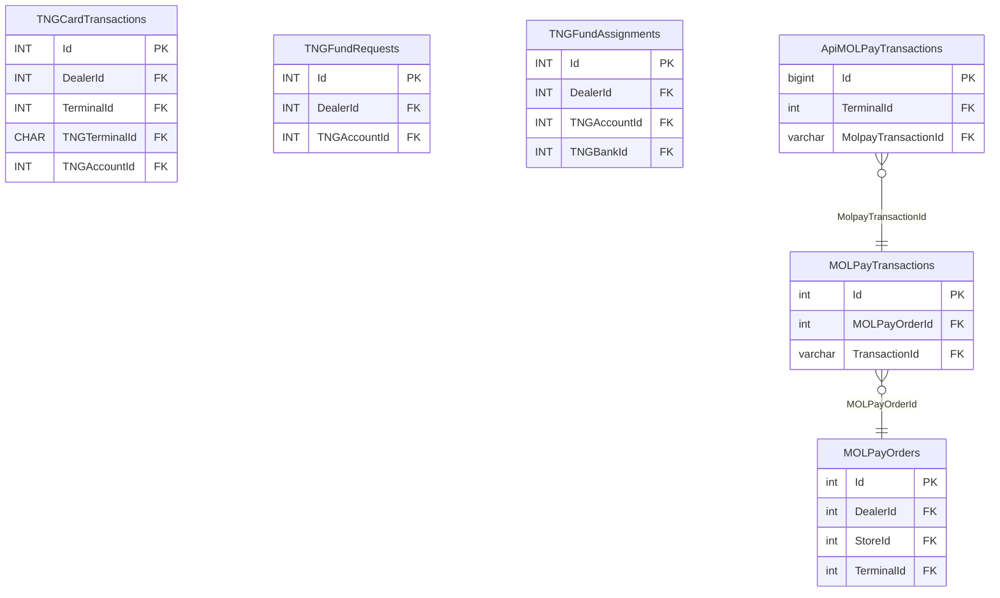
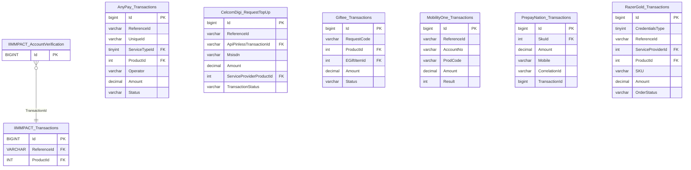

# TRANSACTION — ER diagrams

144+ tables across 19+ schemas (vault says 144 tables / 14 schemas — both
undercounts, see `vault-drift-notes.md` §3). Split by functional cluster;
`_new_GIT1857`/`_new_GIT1858` wide-key migration siblings are omitted from
the diagrams below for legibility (same columns as their non-suffixed
counterpart, `bigint` instead of `int` identity) — see `transaction.md`.

## `dbo` — API staging (representative subset)

## `dbo` — sales & orders

## `dbo` — void & return

## `dbo` — EOD/reconciliation (Bill Payment shown; Gift Card/Stock/MOLPay follow the identical shape)

*(`t_*` = terminal-reported value, `s_*` = system-recorded value — a
mismatch between the two is what `MVarianceTypeId` classifies.)*

## `dbo` — stock & purchasing

## `dbo` — TNG & MOLPay

## Provider schemas (established + missing-from-vault)

Every provider schema follows one of two shapes: a lone `Transactions` table,
or `AccountVerification` → `Transactions`. Shown here: two schemas already in
the vault (`IIMMPACT`, `PayLink`) alongside all 6 confirmed **missing from
the vault** (`vault-drift-notes.md` §3) — real columns, taken directly from
`reload_db/MAINT/TRANSACTION/Table/*.sql`.

Entity names below are prefixed `Schema_Table` purely because Mermaid's
`erDiagram` doesn't allow dots in entity names — the schema is the prefix up
to the first underscore, matching the section's file/column evidence
(`reload_db/MAINT/TRANSACTION/Table/<Schema>.<Table>.sql`).

Dates confirmed from script headers: `AnyPay` 2024-05-14 (`GIT-1067`),
`MobilityOne` 2024-09-21 (`GIT#1338`), `PrepayNation` 2024-12-05 (`GIT#1009`),
`CelcomDigi` 2025-06-18, `RazerGold` 2025-07-09 — all real, established
integrations, not recent/experimental additions.
